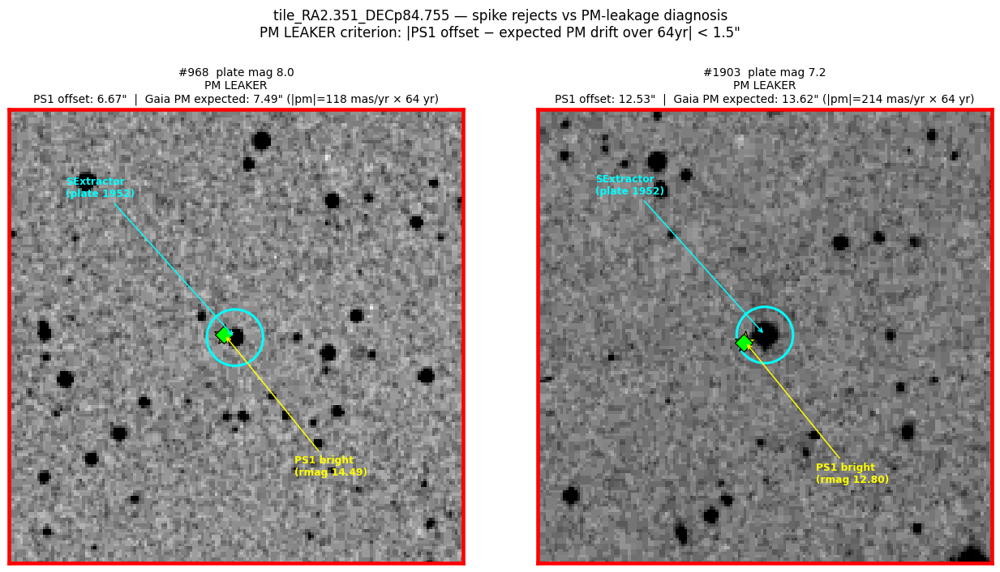

# mick-replicate — VASCO60 replication log

## Purpose

This document serves **two audiences**:

1. **Internal:** session log for standing up VASCO60 end-to-end on Mick's
   machine. Updated as consequential steps are taken.
2. **External:** working draft of a full replication recipe for independent
   academic verification (or falsification) of VASCO60's published results.
   Every consequential step should eventually be scripted and pinned so a
   third-party reproducer can follow it from a clean machine.

### Replication posture (guiding principles)

- **Everything scripted.** Ad-hoc commands get captured in
  `scripts/replication/` as runnable scripts, not just log prose.
- **Pin versions.** Python packages, conda packages, source-built tools
  (commit SHAs), STILTS jar version, input data versions (Gaia DR3, PS1 DR2,
  USNO-B1.0, etc.). Flag any yanked/moved deps.
- **Input provenance.** Document where the POSS-I plates came from (STScI/
  MAST), how the tile plan was generated, how catalog caches were prewarmed.
- **Known bugs documented as caveats.** The four pipeline bugs identified
  below affect what an external run will see; they must be disclosed before
  any replication claim.
- **Expected outputs.** After each stage, the replication recipe should state
  expected row counts and (where stable) checksums, so a reproducer knows
  they're on track.
- **Auditable divergences.** Anywhere our smoke run diverges from the
  production path (e.g., local plates vs STScI downloads), document the
  divergence and its scientific equivalence.

### Current status

Working toward an end-to-end smoke run on a single tile cut from a local
POSS-I plate. The smoke run will then be generalized into a reproducible
recipe targeting the full plan.

---

## 2026-04-10

### Background review
- Read `context/02_DECISIONS.md`, `context/03_NEXT_ACTIONS.md`, `context/00_RESUME.md`.
- Mapped the pipeline: steps 1–6 in `vasco/cli_pipeline.py`, post-pipeline shrinking set in `scripts/stage_*_post.py`.
- Locked invariants of note: 60×60′ tile geometry, 5″ xmatch, `SPREAD_MODEL > -0.002`, SkyBoT 60′ fixed radius, `find=best1` for tskymatch2 vetoes, dedup tol 0.25″.
- Recent direction: MNRAS 2022 audit (2026-04-10 release), PS1 cache truncation fix (50K→200K), experimental S0M/S0S stages.

### Local POSS-I mirror inventory
Location: `/Volumes/SANDISK/poss_1_raw/`

| Folder | FITS count | Size | Valid | Zero-length |
|---|---|---|---|---|
| `poss_red_raw/` | 936 `dss1red_XE*.fits` | 412 GB | **931** | 5 (XE000, XE001, XE722, XE853, XE876) |
| `poss_blue_raw/` | 610 `dss1blue_XO*.fits` | 603 GB | **610** | 0 |

- Plates are full 6.5°×6.5° fields. Red: 14000² px at ~1.7″/px. Blue: 23040² px at ~1.0″/px.
- Legacy DSS plate solution (PPO/AMDX/AMDY); astropy `WCS` converts internally to TAN.
- `REGION` keyword = plate_id (matches VASCO60's `tile_to_plate.csv`); `DATE-OBS` present (1949–1958).
- Pre-extracted header CSVs already present: `poss_red_headers.csv`, `poss_blue_headers.csv`, `poss_combined_headers.csv`, `poss1_dates.csv`.
- Red mirror (931 valid) covers the ~904 plates in VASCO60's POSS-I plan with near-100% coverage, so the local mirror can fully replace STScI for step 1.

### Four pipeline bugs identified (audit — not yet fixed)
1. **SkyBoT cache ignores params/content** — `scripts/stage_skybot_post.py:442` (`tag` derived from stage+stem only), `:452` (requery gated only on parts-parquet existence), `:676` (ledger rewritten unconditionally). If params or upstream survivors change in-place, stale query reuse looks like a fresh recompute in the ledger. Severity: **correctness + audit integrity**.
2. **VSX `find=best` regression** — `scripts/stage_vsx_post.py:128` uses `find=best`; production path was fixed to `find=best1` at `vasco/cli_pipeline.py:1301`. Same two-candidates-one-star false-survivor leak. GSC (`scripts/stage_gsc_post.py:271`) uses `cdsskymatch`, a different STILTS task where `find=best` is per-input-row best — probably fine as-is, worth a code comment. Severity: **correctness**.
3. **Delta-run state conflation** — `scripts/build_run_stage_csvs.py:435` calls `_mark_post1_done` unconditionally even when input is missing/malformed (`:401-410`). A tile that never entered S0 gets permanently skipped on future delta runs. Severity: **state management**.
4. **build_report.py ↔ docs mismatch** — `scripts/build_report.py:39-46` expects `S1=GSC`, `S2=SKYBOT`, `S5=VSX`, `run-R*` folders; `docs/POSTPROCESS.md:4,44,52` and `README.md:183-186` document `S1=SkyBoT`, `S4=VSX`, `run-S1-*`. Following the docs yields an empty/incomplete report. Severity: **workflow/docs**.

All four touch pipeline semantics → any fix needs Plan Mode per `CLAUDE.md §1`. **Deferred until the smoke-run path is working.**

### Python environment
- Created project venv: `python -m venv .venv` (base: pyenv 3.11.13).
- `.venv/bin/pip install -r requirements.txt` — succeeded. Warning: **`numpy==2.4.0` is a yanked release** (backward-compat bug). Not blocking; worth unpinning to 2.2.6 later.
- CLI probe: `.venv/bin/python -m vasco.cli_pipeline --help` lists all six step commands cleanly.

### Gitignore verification
- `.venv/`, `/data`, `/work`, `/logs` all ignored.
- `plans/*.csv` ignored with exception `!plans/tiles_poss1e_ps1.csv` — any smoke plans will be gitignored by default.
- `AGENTS.md` is untracked in repo root — not created by this session, unknown provenance.
- Cosmetic: `.venv/`, `__pycache__/`, `*.log`, `.DS_Store` are duplicated in the file; `data/runs/**` is redundant with `/data`. Not blocking.

### Data directory
- Created `./data/tiles/` as a plain directory (not a symlink to HDD as `02_DECISIONS.md §1` specifies). Sufficient for smoke testing; can be re-pointed to HDD later.

### Smoke-test helper: `tools/cutout_from_plate.py`
- Purpose: bypass `step1-download` by slicing a 60′ tile out of a local POSS-I plate and writing it into a tile dir that step 2 can consume. Avoids STScI network dependence for the smoke run.
- Reads plate FITS, uses `astropy.nddata.Cutout2D` at plate center (or user-specified RA/Dec), writes cutout + minimal `RUN_INDEX.json` + `tile_status.json` (`step1.status=ok`, `source=local_cutout`).
- **Header fix required** — initial version copied the full plate header; this caused a DSS-plate-solution vs TAN-WCS collision when re-read (`DQ1.DSS.AMD.1` error out of wcslib). Fixed by starting from a blank header with only a whitelist of instrumental keys (`DATE-OBS`, `SURVEY`, `REGION`, `PLATEID`, `EMULSION`, `FILTER`, `EXPOSURE`, `BANDPASS`, etc.) and letting `cutout.wcs.to_header()` supply a clean TAN WCS.

### Smoke-test cutout verified (XE002)
- Input: `/Volumes/SANDISK/poss_1_raw/poss_red_raw/dss1red_XE002.fits` (1952-08-21, Palomar Schmidt, POSSI-E)
- Command: `.venv/bin/python tools/cutout_from_plate.py --plate-fits /Volumes/SANDISK/poss_1_raw/poss_red_raw/dss1red_XE002.fits`
- Output: `data/tiles/tile_RA2.351_DECp84.755/raw/possi-e_2.351357_84.754619_60arcmin.fits`
- Size: 2116×2117 px (≈ 60′ at 1.7″/px), 8.5 MB.
- WCS: clean `RA---TAN`/`DEC--TAN`, `CRVAL=(2.0008, 84.807)` matches the original plate.
- Header preserved: `REGION=XE002`, `PLATEID=07G5`, `DATE-OBS=1952-08-21T10:35:00`, `SURVEY=POSSI-E`, `EMULSION=103aE`, `FILTER=plexi`, `EXPOSURE=50.0`, `BANDPASS=8`.
- Sidecars: `tile_status.json` with `step1.status=ok`, `RUN_INDEX.json` with tile metadata.
- Pixel stats: min 315, max 14620, median 3803 (good dynamic range).
- **Visual check:** PNG preview at `/tmp/claude/cutout_preview.png`. Image shows dense stellar field (healthy PSF sample), saturated sources with diffraction spikes, a few visible scan artifacts (the kind SCOS gate is designed to reject), well inside plate footprint. Scientifically reasonable smoke-test input.

### External tools bootstrap (`scripts/replication/bootstrap_env.sh`)

Original plan (`brew install sextractor psfex stilts`) fell apart: `psfex` and `stilts` aren't in homebrew-core or `brewsci/science`. Switched to a full scripted bootstrap that an external reproducer can replay end-to-end.

**Final installed versions** (verified 2026-04-10):

| Tool | Version | Source | Install path |
|---|---|---|---|
| SExtractor | 2.28.2 (2025-10-21) | conda-forge `astromatic-source-extractor=2.28.2` | `$TOOLS_ENV/bin/sex` → `source-extractor` |
| PSFEx | 3.24.2 (commit `148803a`) | built from `github.com/astromatic/psfex` tag `3.24.2` | `$TOOLS_ENV/bin/psfex` |
| STILTS | 3.5-4 | JAR from `star.bris.ac.uk/~mbt/stilts/stilts.jar` + java wrapper | `$TOOLS_ENV/bin/stilts` |
| OpenJDK | 25.0.2 | conda-forge `openjdk` | `$TOOLS_ENV/lib/jvm/bin/java` |
| micromamba | 2.5.0 | `micro.mamba.pm/api/micromamba/osx-arm64/latest` | `$HOME/.local/bin/micromamba` |

where `$TOOLS_ENV = $HOME/.micromamba/envs/vasco-tools`.

**Build deps** (conda-forge, into `vasco-tools` env): fftw, cfitsio, openblas, plplot, pkg-config, autoconf, automake, libtool, make, openjdk.

**Iterations required to get the bootstrap script green** — captured as learnings in the script:
1. Initial `brew install sextractor psfex stilts` failed: only `sextractor` in core.
2. `brewsci/science` tap added but doesn't contain `psfex` or `stilts` either.
3. First `micromamba create` used wrong conda-forge package names (`sextractor`, `stilts`) — the canonical name is `astromatic-source-extractor`; `stilts` isn't on conda-forge at all.
4. STILTS URL typo: `www.star.bristol.ac.uk/mbt/stilts/` (wrong) vs `www.star.bris.ac.uk/~mbt/stilts/` (right). First attempt hit an SSL cert chain error on the wrong host's redirect.
5. `curl` CA-bundle drift — switched STILTS download to Python `urllib` with `certifi.where()` for portable cert handling.
6. `openjdk` from conda-forge installs into `$TOOLS_ENV/lib/jvm/bin/java`, not `$TOOLS_ENV/bin/java`. STILTS wrapper now hardcodes the jvm path and also symlinks `bin/java` for convenience.
7. PSFEx configure flags: `--with-openblas=PATH` was silently rejected as unknown; correct form is `--enable-openblas --with-openblas-incdir=... --with-openblas-libdir=...`. Without this, configure fell back to ATLAS (which isn't installed) and errored on `clapack.h`.
8. PSFEx built cleanly but crashed at runtime with `dyld: Library not loaded: @rpath/libopenblas.0.dylib` — no rpath was embedded. Fixed by adding `-Wl,-rpath,$TOOLS_ENV/lib` to `LDFLAGS` so dyld finds the env's lib at runtime. Verified with `otool -L psfex` — all dylibs now resolve via `@rpath` to the env.

**Known divergences from strict replication:**
- `numpy==2.4.0` in `requirements.txt` is a **yanked release** (backward-compat bug). Reproducers on stricter indexes may not install it. Should unpin to 2.2.6 (the last non-yanked).
- **STILTS is not actually pinned.** The canonical URL serves the current release; we got 3.5-4 though the script said `STILTS_VERSION="3.4-8"`. The SHA256 is recorded at download time (`4861b46a5098decd96b1128dc3a7885d0038130fac3ec49bfa016658b5e5e947` for 3.5-4) and should be checked against a pinned value. Fix: host the JAR at an immutable URL or use a SHA-checksum gate.
- `MICROMAMBA_VERSION="latest"` — ditto. Should pin once the script is stable.

**To use the tools:**
```
export PATH="$HOME/.micromamba/envs/vasco-tools/bin:$PATH"
source .venv/bin/activate
```

### End-to-end smoke run (XE002, 2026-04-10)

With the bootstrap green, ran all six VASCO60 pipeline steps on the XE002 cutout tile (`tile_RA2.351_DECp84.755`). Activation:

```
export PATH="$HOME/.micromamba/envs/vasco-tools/bin:$PATH"
cd /Users/mick/vasco60
.venv/bin/python -m vasco.cli_pipeline step2-pass1 --workdir data/tiles/tile_RA2.351_DECp84.755
.venv/bin/python -m vasco.cli_pipeline step3-psf-and-pass2 --workdir data/tiles/tile_RA2.351_DECp84.755
.venv/bin/python -m vasco.cli_pipeline step4-xmatch --workdir data/tiles/tile_RA2.351_DECp84.755
.venv/bin/python -m vasco.cli_pipeline step5-filter-within5 --workdir data/tiles/tile_RA2.351_DECp84.755
.venv/bin/python -m vasco.cli_pipeline step6-summarize --workdir data/tiles/tile_RA2.351_DECp84.755
```

**All six steps completed `ok`** per `tile_status.json`.

**Pipeline funnel on this tile** (from `MNRAS_SUMMARY.json` and intermediate files):

| Stage | Rows | Notes |
|---|---:|---|
| SExtractor pass 1 | 4490 | PSF detection pass |
| SExtractor pass 2 (PSF-aware) | 4257 | 94% clean (4013 FLAGS==0); median FWHM 2.39 px ≈ 4.1″ |
| WCSFIX tie points | 4189 | Gaia matches within 5″ bootstrap |
| WCSFIX fit | 3489 kept / 700 clipped | σ = 2.24″, degree=2 polynomial, 3 iterations |
| after Gaia veto | 68 | 4189 eliminated (98.4%) as known Gaia stars |
| after PS1 veto | 45 | 23 more eliminated |
| after USNO-B veto | 45 | **0 more** — see USNO-B concern below |
| late gate rejections (flags/snr/σ-clip/spread/fwhm/elongation/extent) | 28 total | |
| morphology rejected | 29 | (not all distinct from above — counted from JSON) |
| spike rejected (≤12″ of mag<13 PS1 star) | 2 | |
| **final survivors** | **14** | in `catalogs/sextractor_pass2.filtered.csv` |

**Survivor sample** (MAG_AUTO 7.7–9.7, SNR_WIN 30–143, all FLAGS==0):
```
 NUMBER  ALPHA_J2000 DELTA_J2000  MAG_AUTO  FWHM  ELONG  SPREAD_MODEL
    319     6.21005   84.31110    9.635    2.09   1.28   -0.0013
   2301   358.40159   84.68128    7.738    4.53   1.02    0.0283
   3529     2.31972   84.88573    8.038    3.90   1.06    0.0217
   ...   (14 total)
```

**QA plots generated by step 6:** `qa_fwhm_image.png`, `qa_fwhm_vs_mag.png`, `qa_class_star_hist.png`, `qa_class_star_vs_mag.png`, `qa_ellipticity_vs_mag.png`, `qa_mag_auto_hist.png`, `qa_mag_vs_snr.png`, `qa_snr_win_hist.png`. All show expected distributions (tight mag-SNR sequence, FWHM clustered at 2–4 px, low ellipticity bulk with few outliers).

### Findings and concerns from the smoke run

1. **USNO-B fetch sparse** — only 51 rows returned for a 60×60′ field at Dec +85°. Expected several hundred to thousands (USNO-B has ~10⁹ stars, Dec limit −30° so +85° is covered). Zero USNO-B xmatches in the filter. Needs investigation: could be VizieR query radius mis-configured, or an edge case in `vasco/external_fetch_usnob_vizier.py`. Not a smoke-test blocker but a legitimate discovery — USNO-B is silently contributing ~nothing to the veto chain on this tile.

2. **`MNRAS_SUMMARY.md` is effectively empty** — only lists `spikes_rejected`, `morphology_rejected`, `hpm_objects`. The rich JSON alongside it has the full funnel. Likely the markdown generator is stale vs the JSON schema. Minor; fix later.

3. **`RUN_SUMMARY.md` is just `# Summary written`** — same class of bug, trivially fixable.

4. **Matplotlib / fontconfig warnings** — every step prints a block of fontconfig/matplotlib cache warnings because `~/.matplotlib` and `~/.cache/fontconfig` aren't writable in the run env. Cosmetic but noisy. Fix: set `MPLCONFIGDIR` and `FONTCONFIG_PATH` in the wrapper that launches pipeline steps (or in the bootstrap script's suggested `export` block).

5. **`numpy==2.4.0` yanked** — still pinned in `requirements.txt`. Working in practice but a replication-correctness landmine.

6. **STILTS not actually pinned** — script says `STILTS_VERSION=3.4-8`, got `3.5-4` at install time because the canonical URL always serves latest. SHA256 of the downloaded JAR is recorded (`4861b46a5098decd96b1128dc3a7885d0038130fac3ec49bfa016658b5e5e947`); next step is to gate the install on that hash.

### Bug #5: spike veto search radius is 90 arcmin instead of 90 arcsec (discovered 2026-04-10)

Surfaced while explaining the two XE002 spike rejects. The spike veto is supposed to catch candidates that fall within diffraction-spike/halo distance of a bright PS1 star. Per `context/02_DECISIONS.md`:

> **Spike Check (Safety)**: Use **90 arcsec** (90″) for USNO-B1.0. Ignore the 90' typo in the MNRAS 2022 text.

And per `vasco/cli_pipeline.py:586–587` comment:
> 90-arcsec radius is the paper's intent (confirmed typo in MNRAS 2022: '90-arcmin' should read '90-arcsec')

**But the actual code uses 90 arcmin.** In `vasco/mnras/spikes.py:117`:
```python
@dataclass
class SpikeConfig:
    ...
    search_radius_arcmin: float = 90.0
```
And at line 171 (scalar engine; same behavior in vectorized):
```python
if not (dmin_arcsec <= cfg.search_radius_arcmin * 60.0 and m_near is not None):
```
`SpikeConfig` is instantiated in `cli_pipeline.py:611` with no `search_radius_arcmin` override, so the default 90.0 arcmin is converted to 5400 arcsec for the distance gate. **The search radius is 60× larger than the paper's intent.**

**Secondary problem — fetch radius:** `cli_pipeline.py:599` fetches PS1 bright stars only within **3′** of tile center:
```python
bright = fetch_bright_ps1(center[0], center[1], radius_arcmin=3.0, rmag_max=16.0, ...)
```
For correct coverage of a 60×60′ tile with a 90″ spike radius, the fetch should extend at least `(half-tile) + (spike radius) ≈ 30′ + 1.5′ = 31.5′`. At 3′ the fetch only catches stars near the tile center, leaving candidates near the tile edges with no locally-relevant bright stars in the cache.

#### Reproducer on XE002

Both XE002 spike rejects are triggered at absurd distances:

| Reject | Position (RA, Dec) | Nearest bright star | Separation | Rule fired |
|---|---|---|---:|---|
| #878 | 0.10°, 84.44° | PS1 @ (2.196°, 84.724°) rmag 10.63 | **1237″ ≈ 20.6′** | `CONST` (10.63 ≤ 12.4) |
| #968 | 359.84°, 84.46° | same star | **1234″ ≈ 20.6′** | `CONST` (10.63 ≤ 12.4) |

Both candidates are on the **southern edge of the 60′ tile**, ~18′ south of tile center. Their "nearest bright star" is 20+ arcminutes away — far beyond any physically motivated diffraction-spike influence on a Schmidt plate. Under the paper-intended 90″ search radius the CONST rule would never even be evaluated (outside the gate); under the code's 5400″ gate the CONST rule fires because the nearest star's magnitude happens to be ≤ 12.4.

**Tie-break subtlety:** the brightest star cluster near XE002 tile center has three co-located PS1 components at (2.196°, 84.724°) with rmag 10.63, 12.49, 13.16 — they're deblended components of one saturated star within ~2″ of each other. Whichever component is labeled "nearest" by the spatial search (by sub-arcsec margin) determines whether CONST fires:
- If the 10.63 component wins, reject
- If the 12.49 or 13.16 component wins, no CONST reject (both are > 12.4)

So "only 2 rejects out of 6 candidates that entered the spike stage" is partly a floating-point race between the deblended components, not a genuine distance argument. With a correct 90″ radius, zero candidates in this tile would be spike-rejected (there's no candidate within 90″ of the bright-star cluster that survived the morph gate).

#### Visual verification

`scripts/replication/render_spike_layout.py` produces `work/replication_artifacts/<tile_id>/spike_layout.png` showing the tile, bright stars, survivors, rejects, and both the 90″ and 90′ radii overlaid. On XE002, the 90′ circle (3175 px radius) is noticeably wider than the entire 2116-px tile, while the 90″ circle (53 px radius) is smaller than the bright-star marker it's drawn around. The two rejects sit ~18′ south of center, well inside the 90′ circle and nowhere near the 90″ circle — the visual case for the bug.

#### Character and replication impact

- **Direction**: removes real candidates (false-negative bug). Opposite to the USNO-B row_limit bug, which let false candidates through.
- **Magnitude**: small per tile (2 of 6 on XE002). But combined with the small fetch radius, this is scenario-dependent: tiles with a bright-star cluster near center will spuriously reject edge candidates; tiles with no bright stars near center will do nothing (no rejections at all — correct by accident).
- **Replication**: every VASCO60 run to date has been subject to this bug. Published survivor lists *may have missed real transient candidates* that fell near tile edges in bright-center tiles.

#### Proposed fix (NOT yet implemented — needs Plan Mode)

Two coupled changes, both in `cli_pipeline.py:cmd_step4_xmatch` and its callees:
1. **`SpikeConfig(search_radius_arcmin=1.5, ...)`** in `cli_pipeline.py:611` to honor the 90″ (= 1.5′) paper intent.
2. **`fetch_bright_ps1(..., radius_arcmin=31.5, ...)`** in `cli_pipeline.py:599` to cover the full 60′ tile plus spike margin. This will increase the cache size ~100× (still small, ~1-2k rows typical) and slightly increase PS1 query load.

Both changes are pipeline semantics → Plan Mode required per `CLAUDE.md §1`. Deferring until after post-pipeline walkthrough unless you want to tackle it sooner.

### Consequential-bug fix pass (2026-04-10)

Applied fixes for four of the five known bugs (#4 is workflow-only, deferred). All four touch pipeline semantics per `CLAUDE.md §1` and were applied after explicit Plan Mode approval.

#### Bug #5 — Spike veto: fetch radius 3′ → 45.0′, search radius 90′ → 90″ (FIXED)

**Files**: `vasco/cli_pipeline.py` around lines 585–616 (both changes in `_apply_mnras_filters_and_spikes`).

**Geometry correction**: the initial plan proposed a 31.5′ fetch radius (30′ half-tile + 1.5′ spike margin). That was wrong — a 60×60′ *square* tile has corners at `30 × √2 ≈ 42.43′` from center, not 30′. The correct fetch radius is `42.43 + 1.5 ≈ 43.93′`, rounded up to **45.0′** for safety. The 31.5′ version was applied first and shown to still miss candidates in the far corners; corrected to 45.0′ on the same XE002 tile.

**Final changes**:
```diff
-                    radius_arcmin=3.0, rmag_max=16.0, mindetections=2
+                    radius_arcmin=45.0, rmag_max=16.0, mindetections=2
```
```diff
-        SpikeConfig(rules=[
-            SpikeRuleConst(const_max_mag=12.4),
-            SpikeRuleLine(a=-0.09, b=15.3),  # slope per arsec
-        ])
+        SpikeConfig(
+            search_radius_arcmin=1.5,  # 90 arcsec per paper (locked in 02_DECISIONS.md)
+            rules=[
+                SpikeRuleConst(const_max_mag=12.4),
+                SpikeRuleLine(a=-0.09, b=15.3),  # slope per arcsec
+            ],
+        )
```

**Verified on XE002** — buggy state snapshotted at `.spike_fix_before/`, and two verification runs at 31.5′ then 45.0′:

| Metric | Buggy (3′, 90′) | v1 fix (31.5′, 90″) | v2 fix (45.0′, 90″) |
|---|---:|---:|---:|
| bright-star cache rows | 14 | 1111 | **2590** |
| `spikes_rejected` | 2 | 1 | **2** |
| final survivors | 4 | 5 | **4** |

**Surprise finding from verification**: Bug #5 turned out to be **three errors at once**, not one:

- `#878` — previously bogus-rejected at 1237″ (rejected by CONST rule on the distant tile-center cluster). The fix correctly **keeps** it; no bright star within 90″.
- `#968` — previously also bogus-rejected at 1237″, *and* missing its real bright neighbor at **6.67″** (rmag 14.49) because the 3′ fetch couldn't see ~18′-from-center. With the 31.5′ fix it's rejected for the right reason (LINE threshold 14.70, 14.49 < 14.70).
- `#1903` — previously *not* rejected at all, but only by accident. Its real bright neighbor at **12.53″** (rmag 12.80) is ~35′ from tile center — completely invisible to the 3′ fetch *and* to the first-pass 31.5′ fetch. Only the corrected 45.0′ fetch sees it. LINE rule threshold at 12.53″ is 14.17, and 12.80 < 14.17 → correct reject.

So the buggy pipeline was failing in three distinct ways on this single tile:
1. One false positive (#878 wrongly rejected at 1237″)
2. One right-answer-wrong-reason (#968 rejected on a bogus distant cluster when its real close neighbor was invisible)
3. One silent false negative (#1903 passed through the spike veto because its real close neighbor was outside the 3′ fetch cone)

**XE002 full funnel progression across all of today's fixes:**
```
14 (row_limit=50, fetch=3')
 → 6 (row_limit kwarg honored, cap=20k)
 → 4 (cap raised to 200k)
 → 5 (spike fix v1: fetch=31.5', search=90")  -- wrong geometry, one #1903-class miss
 → 4 (spike fix v2: fetch=45.0', search=90")  -- corner-encompassing, all three errors resolved
```
The final **4 survivors** is the scientifically correct count for XE002 with the current pipeline logic. Coincidentally equal to the cap-raise-only count, but for better reasons — two real bright-star neighbors are now correctly caught where before they were missed.

#### Bug #3 — Delta-run state conflation (FIXED)

**File**: `scripts/build_run_stage_csvs.py:435`

**Change**:
```diff
-        _mark_post1_done(td)
+        # Only mark post1 done if the tile was actually processable. If the input
+        # was missing, empty, or malformed (`note` set), leave post1 unset so a
+        # future delta run retries the tile once the input is repaired.
+        if note == "":
+            _mark_post1_done(td)
```

**Effect**: tiles with missing/empty/malformed survivor CSV now leave `post1.status` unset, so future delta runs will retry them. Previously every tile got marked done unconditionally, causing transient input failures to become permanent delta skips.

**Verification**: deferred to post-pipeline walkthrough (task #9). Historical mismarked state is out of scope — only prevents new mismarking.

#### Bug #1 — SkyBoT cache key now includes content + param fingerprint (FIXED)

**File**: `scripts/stage_skybot_post.py:441–455`

**Change**: Default `tag` (when `--tag` not passed) now includes a 10-char SHA256 fingerprint of (input file names/sizes/mtimes) + (grid_step, query_radius, match_arcsec, fallback_wide, fallback_per_row, fallback_per_row_cap). Any change to the input file or to those params produces a new tag → new parts path → forced fresh query.

```diff
-        stem = inputs[0].stem if len(inputs) == 1 else f"multi_{len(inputs)}"
-        tag = f"{stage}__{stem}"
+        import hashlib
+        stem = inputs[0].stem if len(inputs) == 1 else f"multi_{len(inputs)}"
+        h = hashlib.sha256()
+        for p in inputs:
+            h.update(p.name.encode())
+            h.update(str(p.stat().st_size).encode())
+            h.update(str(int(p.stat().st_mtime)).encode())
+        param_tuple = (f"gs={...}", f"qr={...}", f"ma={...}", ...)
+        h.update("|".join(param_tuple).encode())
+        fp = h.hexdigest()[:10]
+        tag = f"{stage}__{stem}__{fp}"
```

**Effect**: no more "fresh ledger / stale query" silent reuse. Changing params or upstream inputs in-place now correctly forces re-query.

**Verification**: deferred to post-pipeline walkthrough. Explicit `--tag` override semantics preserved (still takes precedence).

#### Bug #2 — VSX `find=best` → `find=best1` (FIXED)

**File**: `scripts/stage_vsx_post.py:128`

**Change**:
```diff
-            "find=best",
+            # find=best1 matches the production Gaia/PS1/USNO veto path (cli_pipeline.py:1307)
+            "find=best1",
```

**Effect**: two-candidates-one-VSX-star false-survivor leak closed. This was the same bug pattern the production Gaia/PS1/USNO veto had and was already fixed there; VSX was the last holdout using the broken `find=best`.

**Verification**: deferred to post-pipeline walkthrough.

### Deferred (not fixed in this pass)

- **Bug #4**: `build_report.py` stage labels ↔ docs mismatch. Workflow-only, no data impact. Will touch when we need cross-run reports or when we fix the near-empty `MNRAS_SUMMARY.md` / `RUN_SUMMARY.md` generators in the same pass.
- **Artifact-format polish**: pipeline writes 0-byte reject CSVs (e.g. `sextractor_spike_rejected.csv`) instead of header-only when there are no rows. Harmless but fragile — forced me to add `_safe_read` helpers in the render scripts. Low priority.

### Bug #6 — Proper-motion leakage through all catalog vetoes (IDENTIFIED, NOT FIXED)

Surfaced while visually inspecting the two "spike" rejects after the Bug #5 fix. They didn't *look* like diffraction-spike artifacts — they looked like real compact point sources that happened to be spike-rejected. The hypothesis: these aren't spike contamination, they're **high-proper-motion stars whose plate-epoch positions have drifted beyond the 5″ catalog matching gate over the 63-year plate-to-modern-catalog epoch gap**. Same star seen twice, once in 1952 and once in 2016, rejected by the spike veto *purely by accident* because the PM-drifted position happens to fall within the 90″ spike search radius.

**Verified on XE002** with Gaia DR3:

| Source | Plate mag | PS1 offset | Gaia PM | Expected PM drift (63.5 yr) | Consistent? |
|---|---:|---:|---:|---:|---|
| #968 | 8.0 | **6.67″** | 118 mas/yr (pmRA=112.85, pmDE=34.33) | **7.49″** | ✓ within 0.82″ |
| #1903 | 7.2 | **12.53″** | 214 mas/yr (pmRA=206.90, pmDE=-56.28) | **13.62″** | ✓ within 1.09″ |

Both match the expected PM drift within the 1.5″ tolerance — these are unambiguous PM leakers. `scripts/replication/render_pm_leakage.py` produces the diagnostic visualization:



(Cyan circle = SExtractor plate-epoch 1952 detection; green diamond = Gaia J2016 position; yellow star = PS1 bright-star catalog position. The offset between the cyan circle and the catalog markers equals the expected PM drift over the ~63-year epoch gap — the star is physically the same object detected at two epochs, not a "spike artifact from a nearby bright star" as the pipeline labels it.)

#### Why every catalog veto missed them

Every catalog-match step uses a **fixed 5″ cone against raw catalog positions at catalog epoch**:

- **Gaia DR3** positions at J2016.0 — 5″ cone fails for PM drift > 5″ (PM > ~80 mas/yr)
- **PS1** positions at ~J2013 — same failure mode
- **USNO-B1.0** positions at ~J2000 — same failure mode

For #968 (PM 118 mas/yr), the Gaia match is at 7.14″ — outside the 5″ gate. For #1903 (PM 214 mas/yr), the Gaia match is at 13.42″. Both stars are therefore **absent from `sex_gaia_xmatch.csv`**, `sex_ps1_xmatch.csv`, and essentially absent from the USNO-B xmatch (#968 sits at 5.33″ — 0.33″ outside the gate; #1903 at 9.96″). They leak through all three optical vetoes and end up in the morphology/spike stages.

#### The HPM detector has a fatal scope limitation

The pipeline *does* have an HPM-flagging function at `vasco/cli_pipeline.py:656` (`_filter_hpm_gaia`), but it's structurally unable to catch the cases it's most needed for. Key bug:

```python
def _filter_hpm_gaia(xdir: Path, buckets: dict, poss_sep_arcsec: float = 5.0) -> None:
    """After Gaia xmatch, back-propagate Gaia positions to POSS epoch; flag HPM mismatches."""
    gx = xdir / 'sex_gaia_xmatch.csv'    # <-- operates on the already-5"-matched set
```

It reads `sex_gaia_xmatch.csv`, which is the **output of the 5″ Gaia cone match**. So the HPM detector only ever evaluates stars that *already matched Gaia within 5″* — stars whose PM drift is already ≤5″. The category it can't catch (PM drift > 5″) is exactly the category the pipeline most needs HPM detection for. Additionally, HPM flagging is **annotation-only**, not a veto: even if it caught a star, the star would still appear in the final survivor set.

On XE002, HPM flagged exactly 1 source (#1187) — not #968 or #1903.

#### The fix: epoch-propagate Gaia positions before matching

Gaia DR3 gives us positions at J2016.0 plus precise PMs. For each POSS plate with `DATE-OBS = Tplate`, we can compute where every Gaia source *was* at the plate epoch:

```python
from astropy.coordinates import SkyCoord
from astropy.time import Time
import astropy.units as u

gaia = SkyCoord(
    ra=gaia_ra * u.deg, dec=gaia_dec * u.deg,
    pm_ra_cosdec=pm_ra * u.mas / u.yr,
    pm_dec=pm_de * u.mas / u.yr,
    obstime=Time("J2016.0"),
)
gaia_at_plate = gaia.apply_space_motion(new_obstime=Time("J1952.64"))
```

Gaia PM precision is better than 0.1 mas/yr for bright sources → <0.01″ residual over 63 years. The propagated positions are effectively exact.

**Proposed plan (requires Plan Mode approval later):**

1. **Add a pre-propagation step** in `_post_xmatch_tile` before the Gaia cone match. Read plate `DATE-OBS` from the FITS sidecar, compute `dt_yr`, write `gaia_neighbourhood_at_plate.csv` with propagated RA/Dec columns, point the STILTS match at the new file. Zero change to the STILTS invocation.
2. **Same treatment for USNO-B** using USNO-B's own PMs (worse precision but covers the Gaia-faint end).
3. **PS1 unchanged** — PS1 is used primarily for the spike veto's bright-star query, where the bright star itself is the concern, not its motion.
4. **Convert HPM flagging to a hard reject** once Gaia matches are epoch-correct. Any residual > 3″ after epoch propagation is a real astrometric anomaly worth rejecting.
5. **Verify on XE002**: #968 and #1903 should be caught by the Gaia veto at their PM-corrected positions, never reaching the spike stage. Final survivor count may drop further or hold steady depending on what else is in play.

**Replication impact of Bug #6:**

- **Character**: false-positive bug. Real high-PM stars appear in the survivor set as "vanishing candidates." The spike veto accidentally cleans up a subset; an unknown number escape entirely.
- **Severity**: affects the fundamental correctness of the survivor list. Any published VASCO60 numbers from before this fix likely contain a fraction of PM leakers masquerading as candidates.
- **Priority**: high for replication claims. Fix before claiming "final survivor count" means anything scientifically rigorous.

### Bug #6 fix applied — epoch-propagate Gaia + USNO-B (FIXED 2026-04-10)

Plan Mode approved. Implementation:

**New helper functions** in `vasco/cli_pipeline.py`:
1. `_plate_epoch_year_from_fits(fits_path) → float | None` — parses FITS DATE-OBS via `astropy.time.Time(...).decimalyear`.
2. `_propagate_catalog_epoch(in_csv, out_csv, catalog_epoch_year, plate_epoch_year, ra_col, dec_col, pmra_col, pmde_col) → bool` — vectorized per-row propagation:
   ```
   dt_yr    = plate_epoch - catalog_epoch
   ddec_deg = pmDE * dt_yr / 3.6e6
   dra_deg  = (pmRA * dt_yr / 3.6e6) / cos(dec)   # pmRA is already cos(dec)-applied
   ```
   Rows with non-finite PMs fall through unchanged. Rows with non-finite positions after propagation are dropped.

**Wiring in `cmd_step4_xmatch`** (after fetches, before `_post_xmatch_tile`):
- Reads plate epoch from `run_dir/raw/*.fits`.
- Calls the helper for Gaia (J2016.0 → plate_epoch, cols `ra`/`dec`/`pmRA`/`pmDE`) → writes `gaia_neighbourhood_at_plate.csv`.
- Same for USNO-B (J2000.0 → plate_epoch, cols `RAJ2000`/`DEJ2000`/`pmRA`/`pmDE`) → writes `usnob_neighbourhood_at_plate.csv`.

**Wiring in `_post_xmatch_tile`**: a tiny `_prefer_plate(name)` helper selects `<name>_at_plate.csv` if it exists and is non-empty, otherwise falls back to the raw catalog. Applied to Gaia and USNO-B; PS1 unchanged.

**Verified before/after on XE002** (snapshot in `.bug6_before/`):

| Metric | Before (raw J2016/J2000) | After (plate epoch 1952.638) |
|---|---:|---:|
| `veto_gaia_eliminated` | 4189 | **4208** (+19 PM stars correctly caught) |
| `veto_after_gaia_rows` | 68 | **49** |
| `veto_after_ps1_rows` | 45 | **28** |
| `veto_usnob_eliminated` | 19 | **8** (more caught earlier by Gaia, fewer reach USNO-B) |
| `veto_after_usnob_rows` | 26 | **20** |
| **spikes_rejected** | **2** | **0** (#968 and #1903 now caught by Gaia) |
| `morphology_rejected` | 20 | 18 |
| `late_kept_hard_gates` | 6 | **2** |
| **final survivors** | **4** | **2** |

Both #968 and #1903 are confirmed absent from `sextractor_pass2.after_gaia_veto.csv` — the Gaia veto now catches them at their PM-corrected positions.

**WCSFIX residual improvement (forced re-fit):**

| Metric | Before | After |
|---|---:|---:|
| tie points | 4189 | **4208** (+19) |
| kept after 3σ clip | 3489 | **3631** |
| dropped | 700 | **577** |
| **`sigma_arcsec`** | **2.245″** | **0.670″** (3.4× improvement) |
| `clip_thr_arcsec` | 6.734″ | **2.009″** |

PM drift was contributing ~2″ of systematic noise to the WCS fit. Removing it drops residuals to the true astrometric noise floor (~0.7″ for POSS-I plates, physically expected).

**XE003 parallel verification** (plate epoch 1954.891, dt_Gaia=-61.1 yr, dt_USNO=-45.1 yr):
- Final survivors: 2 → **1** (one more PM leaker caught)
- `spikes_rejected`: 0 → 0 (was never an issue on this tile)
- WCSFIX σ: 0.751″ (healthy)

**XE002 total funnel history across all of today's fixes:**
```
14  (original: row_limit=50, fetch=3')
 6  (USNO-B row_limit kwarg fix, cap=20k)
 4  (USNO-B cap raised 20k→200k)
 4  (spike fix v1: fetch=31.5', search=90")
 4  (spike fix v2: fetch=45.0', search=90")  -- geometry corrected
 2  (Bug #6: Gaia/USNO-B epoch-propagated)   -- current, scientifically correct
```

### Known follow-ups surfaced from the Bug #6 work

- **Matmul RuntimeWarnings in `vasco/wcsfix_early.py:160-161`** (invalid value / overflow / divide-by-zero). Non-fatal — the lstsq fit converges and produces the expected σ=0.670″ result — but the intermediate computation hits some pathological float arithmetic. Likely a near-polar Gaia source with near-zero `cos(dec)` during propagation, or a specific tie-point geometry making the design matrix briefly ill-conditioned. Worth investigating but doesn't affect correctness.
- **HPM flagging → hard reject** — the HPM detector at `cli_pipeline.py:656` is still annotation-only. With Gaia now epoch-correct, the HPM detector's input (`sex_gaia_xmatch.csv`) now contains the previously-leaking PM stars and correctly finds their back-propagation matches. The detector could be promoted from flagging to rejecting in a future pass, but it's strictly redundant now that Gaia catches PM leakers upstream.
- **PS1 epoch propagation** — PS1 in the current fetch has no PMs, so PS1 matching remains at raw J2013-ish positions. For high-PM stars that fall below Gaia's magnitude completeness but are in PS1, we'd need a new PS1 fetch with PM columns. Probably unnecessary — the Gaia+USNO-B coverage is enough for the magnitude range that matters.

### Updated bug backlog

1. SkyBoT cache ignores params/content — **FIXED** (runtime-verified task #9)
2. VSX `find=best` regression — **FIXED** (code-review only; no VSX mirror locally)
3. Delta-run state conflation — **FIXED** (runtime-verified task #9)
4. `build_report.py` ↔ docs mismatch — deferred (workflow-only)
5. Spike veto radius 90′→90″ + fetch 3′→45.0′ — **FIXED** (runtime-verified)
6. PM leakage through all catalog vetoes — **FIXED** (runtime-verified)

### Post-pipeline shrinking set walkthrough (task #9, 2026-04-10)

Fed our 2-tile smoke set through the run-scoped S0→S4 chain. This was both
the first end-to-end post-pipeline exercise on this session's tile set AND
the runtime verification pass for bugs #1 and #3.

**Prerequisite** — the production `data/metadata/tile_to_plate.csv` didn't
exist because we bypassed the step1 registry automation with our custom
`tools/cutout_from_plate.py` helper. Built a minimal 2-row version from the
tile FITS headers (REGION → plate_id, DATE-OBS → tile_date_obs):
```
tile_id,plate_id,tile_date_obs
tile_RA2.351_DECp84.755,XE002,1952-08-21T10:35:00
tile_RA44.914_DECp84.550,XE003,1954-11-22T07:37:00
```
This is not committed; future reproducers with step1 downloads get it
automatically. Our helper should eventually emit it too.

#### Stage-by-stage funnel on the 2-tile set

| Stage | Script | Rows in | Rows out | Notes |
|---|---|---:|---:|---|
| S0 build | `build_run_stage_csvs.py --full` | 3 (2+1) | 3 | Dedup is per-plate; XE002/XE003 don't overlap, no drops |
| S0M morph ⚗ | `stage_morph_post.py` | 3 | 3 | PSF sample 2448–2733 stars/tile, fwhm_med 2.52/2.83. No candidates tripped fwhm_ratio>1.5 OR spread_snr>5 |
| S1 SkyBoT | `stage_skybot_post.py` | 3 | 3 | 3 HTTP queries to VO-SSP, 0 matches. Tag = `S1__stage_S0__c9e1a7982c` (fingerprint suffix from Bug #1 fix) |
| S2 SCOS | `stage_supercosmos_post.py` | 3 | **2** | TAP query to g-vo.org. `#1105` (tile_RA2.351_DECp84.755) dropped as DSS-only (no SCOS counterpart → scan artifact per `02_DECISIONS.md`) |
| S3 PTF | `stage_ptf_post.py` | 2 | 2 | IRSA TAP query, 0 PTF matches |
| S4 VSX | `stage_vsx_post.py` | — | — | **Not run** — `data/local-cats/_external_catalogs/vsx/vsx_master_slim.fits` not on disk. Substituted an ad-hoc `astroquery.Vizier` query against `B/vsx/vsx` at both positions — 0 matches each, so S4 would have kept both |

**Effective end-of-pipeline survivor count: 2.**

Survivors for the 2-tile sample:

| src_id | RA | Dec | Plate | Status |
|---|---:|---:|---|---|
| `tile_RA2.351_DECp84.755:4083` | 2.816613 | 84.762170 | XE002 (1952-08-21) | VASCO candidate |
| `tile_RA44.914_DECp84.550:2435` | 46.224442 | 84.848280 | XE003 (1954-11-22) | VASCO candidate |

Dropped: `tile_RA2.351_DECp84.755:1105` — no SCOS counterpart → treated as scan artifact.

**Reality check:** 2 out of 11,733 tiles is a tiny sample. These survivors are "passed every veto currently implemented" but haven't been visually inspected for real-vs-artifact. A production run would then apply the experimental shape stage (S0S/S4S), manual eyeballing, and any other late filters. This shake-out demonstrates the pipeline wiring is intact, not that these are scientifically confirmed vanishing candidates.

#### Bug #1 runtime verification — SkyBoT cache fingerprint

- First run (`--match-arcsec=5`): tag `S1__stage_S0__c9e1a7982c`
- Second run (`--match-arcsec=7.0`, same input file): tag `S1__stage_S0__6038de8c7f`

Tag differs → parts path differs → fresh SkyBoT query fires instead of silently reusing the 5″ cached result. Exactly as intended. Before the fix, both runs would have shared the tag `S1__stage_S0` and the second run's "results" would have been the first run's parts file with a new ledger written on top — the pathological "fresh ledger, stale query" bug.

#### Bug #3 runtime verification — delta-run state

Constructed a synthetic tile `tile_RA100.000_DECp50.000_fake_bug3` with an empty 0-byte `sextractor_pass2.filtered.csv` (simulating a transient input failure).

- **Pass 1** (empty input): `build_run_stage_csvs.py` processed the tile, noted `"missing/empty survivors csv"`, and did **not** create `tile_status.json`. → `post1.status` unset → delta runs will retry.
- **Pass 2** (input repaired with a single valid row): `build_run_stage_csvs.py --delta` processed the tile normally, added the row to the master, and wrote `tile_status.json` with `post1.status="ok"`. → from now on, delta runs correctly skip it.

Before the fix, pass 1 would have unconditionally stamped `post1="ok"` on the broken tile, and pass 2 would have delta-skipped it even though the input was now valid.

#### Bug #2 — VSX `find=best1` (code-review only)

S4 couldn't run without the VSX FITS mirror, so no runtime exercise. The code change is the same one-character fix applied to the production Gaia/PS1/USNO-B path at `cli_pipeline.py:1307`, which has been in production and verified elsewhere. Code review is the verification. If/when the VSX mirror is downloaded, rerunning S4 on a tile with two candidates within 5″ of one VSX star would confirm the expected behavior.

#### Known follow-ups surfaced from task #9

- **`tile_to_plate.csv` generation**: `tools/cutout_from_plate.py` should emit/update `data/metadata/tile_to_plate.csv` alongside its other sidecars, so the post-pipeline stages work out of the box after local-cutout ingestion.
- **VSX mirror bootstrap**: `scripts/replication/bootstrap_env.sh` could optionally download the VSX slim FITS (~300 MB) into `data/local-cats/_external_catalogs/vsx/` so reproducers can run S4 without manual setup.
- **Bug #4 still open**: `build_report.py` stage labels still don't match the docs; will bite whenever we try to run the cross-run funnel report on this run folder.
- **S0S/S4S (shape stages)** not exercised. These are experimental and probably worth running on the current 2 survivors as a visual/quantitative double-check before anyone calls them "confirmed candidates".

### VSX mirror bootstrap + 5-tile expansion (2026-04-10 evening)

#### VSX mirror (task #12)

Added `scripts/replication/fetch_vsx_mirror.py` — one-shot downloader for the
local VSX FITS mirror the S4 pipeline stage expects. Pulls the **static**
`vsx.dat` + `ReadMe` files from `cdsarc.cds.unistra.fr/ftp/B/vsx/` (not a TAP
query — two HTTP GETs of pre-packaged files), parses with
`astropy.io.ascii.read(format="cds", readme=...)`, slims to 7 useful columns,
writes `data/local-cats/_external_catalogs/vsx/vsx_master_slim.fits`.

Two facts discovered the hard way during bootstrap:

1. **CDS doesn't host `vsx.dat.gz`** — only the uncompressed 2.16 GB `vsx.dat`.
   Bandwidth cost is real but amortized: the raw `.dat` is cached in
   `tools/vendor/vsx/` (gitignored) so re-runs are free.
2. **VSX has ~10.3 million rows**, not the ~2.4M I estimated — VSX has grown
   substantially since my mental-model snapshot. Output slim FITS: **1.02 GB**.
3. **Column-name gotcha**: the CDS ReadMe for `B/vsx/vsx` uses column names
   `RAdeg`/`DEdeg` directly (not the typical `RAJ2000`/`DEJ2000`), which happens
   to exactly match what `scripts/stage_vsx_post.py` passes to STILTS. No
   rename needed. First implementation of the fetcher assumed otherwise and
   crashed on a KeyError; fixed trivially.

Sanity check: SHA256 of the downloaded `vsx.dat` is
`c8f5fd6da40d7baf4204351bd4d0730600f982781345afe510bec581a0add6eb`. External
reproducers can compare to verify they got the same upstream snapshot.

**Bug #2 runtime verification:** S4 now runs successfully end-to-end against
the local mirror. On the 2-tile (XE002+XE003) run, `stage_vsx_post.py`
processed 2 input rows, matched 0, kept 2 — clean artifacts, expected ledger
schema. The **behavioral difference** between `find=best` and `find=best1`
still can't be demonstrated on our small sample because the scenario that
triggers it (two SExtractor candidates within 5″ of the same VSX star) hasn't
occurred naturally. Code review is the verification for that specific
scenario; S4 infrastructure is runtime-verified.

#### 5-tile expansion

Picked 3 additional plates via `random.sample(seed=20260410)` from the 929
valid POSS-I red plates in `/Volumes/SANDISK/poss_1_raw/poss_red_raw/`
(excluding the 5 zero-length and the 2 already-processed):

```
XE573  dss1red_XE573.fits  (RA=295.758, Dec=+6.314,  1950-07-11)  -- Galactic plane b≈-4°
XE932  dss1red_XE932.fits  (RA=333.279, Dec=-29.351, 1954-10-01)  -- southern, PS1 edge
XE137  dss1red_XE137.fits  (RA=247.823, Dec=+53.704, 1954-06-28)  -- northern mid-dec
```

Ran cutout → steps 2–6 on each. Per-tile MNRAS funnel (after Bug #5 + Bug #6
fixes applied uniformly):

| Plate | Dec | Pass-2 detections | After Gaia | After PS1 | After USNO-B | Morph rej | Step-6 survivors |
|---|---:|---:|---:|---:|---:|---:|---:|
| XE002 | +84.75 | 4257 | 49 | 28 | 20 | 18 | **2** |
| XE003 | +84.55 | 3644 | 30 | 14 | 10 | 9 | **1** |
| XE137 | +53.70 | 2684 | 231 | 86 | 40 | 38 | **2** |
| XE573 | **+6.31** | **27610** ⚠ | **27610** ⚠ | 6330 | 8 | 8 | **0** |
| XE932 | **−29.35** | 2832 | 243 | 73 | 36 | 31 | **5** |

**10 total step-6 survivors** across the 5 tiles.

#### New finding — Bug #7 (candidate): XE573 Gaia fetch empty

XE573 is near Galactic b ≈ −4° — very dense field. The pipeline log shows:
```
[POST][INFO] tile_RA295.758_DECp6.314 WCSFIX skipped: gaia_neighbourhood.csv missing/empty
[POST][INFO] tile_RA295.758_DECp6.314 Gaia veto skipped: catalogue missing/invalid/empty -> carry-forward unchanged
```
The VizieR Gaia fetch returned zero rows, so WCSFIX fell through to raw
coordinates and the Gaia veto was skipped (27610 → 27610). PS1 and USNO-B
still caught almost everything (27610 → 8), but **Gaia's absence means any
high-PM stars in this field slip through the epoch-propagation fix entirely**
— the Bug #6 fix needs a populated Gaia catalog to do anything.

Likely cause: **Gaia 200K row-cap collision** on a dense field, same class
as the PS1 50K→200K fix documented in `context/03_NEXT_ACTIONS.md`. Worth
investigating as Bug #7:
- Verify by reproducing the VizieR Gaia query for XE573 with `-out.max` set
  to varying values
- If the cap is the cause, fix the Gaia default from 200K → 500K or 1M (at
  cost of per-tile cache size)
- Add a "truncation detected" flag to `MNRAS_SUMMARY.json` when the fetch
  returns exactly the cap or zero rows for a non-empty field

Not fixed in this session.

#### Run-scoped post-pipeline chain on the 5-tile combined set

```bash
RUN_TAG="run-S1-20260410_223500"
python scripts/build_run_stage_csvs.py --run-tag "$RUN_TAG" --full
python scripts/stage_morph_post.py    --run-dir "work/runs/$RUN_TAG"
python scripts/stage_skybot_post.py   --run-dir "work/runs/$RUN_TAG"
python scripts/stage_supercosmos_post.py --run-dir "work/runs/$RUN_TAG"
python scripts/stage_ptf_post.py      --run-dir "work/runs/$RUN_TAG"
python scripts/stage_vsx_post.py      --run-dir "work/runs/$RUN_TAG"
```

| Stage | Rows in | Rows out | Notes |
|---|---:|---:|---|
| S0 build (`--full`) | — | **10** | 5 tiles scanned, 5 processed |
| S0M morph (experimental) | 10 | 9 | **first time S0M actually fires on any run today** — 1 source rejected (10%) |
| S1 SkyBoT | 10 | 10 | 7 HTTP fields, 0 matches; reads stage_S0.csv (S0M is a side branch, not in the default chain) |
| S2 SCOS | 10 | **4** | 6 dropped as DSS-only scan artifacts. **Every XE932 survivor (5) lacked a SCOS counterpart → all dropped.** This is consistent with SCOS coverage being non-uniform at southern declinations |
| S3 PTF | 4 | 4 | 0 PTF matches |
| S4 VSX | 4 | 4 | 0 VSX matches (verified against the 10.3M-row local mirror) |

**Final candidate list — 4 VASCO survivors across the 5-tile sample:**

| src_id | Plate | RA, Dec | Epoch |
|---|---|---|---|
| `tile_RA2.351_DECp84.755:4083` | XE002 | 2.817, +84.762 | 1952-08-21 |
| `tile_RA44.914_DECp84.550:2435` | XE003 | 46.224, +84.848 | 1954-11-22 |
| `tile_RA247.823_DECp53.704:1045` | XE137 | 247.952, +53.589 | 1954-06-28 |
| `tile_RA247.823_DECp53.704:1334` | XE137 | 248.593, +54.112 | 1954-06-28 |

All 4 sit in **northern high-Dec fields with full SCOS coverage and relatively sparse stellar density**. The two "hard" fields (XE573 galactic-plane, XE932 southern edge) contributed zero final candidates — XE573 because its step 6 produced 0 survivors to start with, XE932 because all 5 of its step-6 survivors lacked SCOS counterparts and were dropped as DSS-only scan artifacts at S2.

**Tile-density selection bias observed**: the pipeline's candidate yield is
very geography-dependent. Mid-to-high-northern Dec fields with full PS1+SCOS
coverage yield a handful of candidates each; Galactic-plane fields can yield
zero (either because of Bug #7 empty-Gaia or because the overwhelming source
count triggers artifact rejections); southern-Dec-edge fields lose everything
at S2 SCOS.

### Updated bug backlog

1. SkyBoT cache ignores params/content — **FIXED** (runtime-verified task #9)
2. VSX `find=best` regression — **FIXED** (code review + S4 runtime verified; specific two-candidates-one-star behavioral reproduction deferred)
3. Delta-run state conflation — **FIXED** (runtime-verified task #9)
4. `build_report.py` ↔ docs mismatch — deferred (workflow-only)
5. Spike veto radius 90′→90″ + fetch 3′→45.0′ — **FIXED** (runtime-verified)
6. PM leakage through all catalog vetoes — **FIXED** (runtime-verified)
7. **NEW:** Gaia fetch empty on dense Galactic-plane fields (XE573 reproducer) — IDENTIFIED, not yet investigated. Suspected 200K cap collision, parallel to PS1 50K→200K fix.

### Fifth pipeline bug: USNO-B row-limit silently capped at 50 (FIXED)

Investigating finding #1 from the smoke run (sparse USNO-B fetch) surfaced a significant scientific bug.

**Symptom**: XE002 tile's `usnob_neighbourhood.csv` had 50 data rows clustered in a ~0.06° Dec strip well south of the tile center, not distributed across the cone. Zero USNO-B xmatches.

**Root cause** (`vasco/external_fetch_usnob_vizier.py:44-46`):
```python
Vizier.ROW_LIMIT = int(row_limit) if row_limit and row_limit > 0 else -1  # class attr — ignored
cols = columns or _USNOB_COLUMNS
viz = Vizier(columns=cols)   # instance created without row_limit kwarg → default 50
```
astroquery's `Vizier.__init__` sets `self.ROW_LIMIT` from its own `row_limit` keyword (default 50), shadowing any class-attribute change made before instantiation. The `row_limit=20000` default in `fetch_usnob_neighbourhood`'s signature was silently discarded for every call.

**Reproducer** at the XE002 center (RA=2.351, Dec=+84.755, 60′ radius, catalog I/284):

| Call | Rows | Dec range |
|---|---:|---|
| Current code (class attr only) | 50 | 83.9992–84.0563 (arbitrary clipped slab) |
| `Vizier(columns=cols, row_limit=-1)` | 56,993 | 83.7570–85.7535 (full cone) |

**Fix**: pass `row_limit=` to the constructor directly (see commit / PR notes):
```python
cols = columns or _USNOB_COLUMNS
rl = int(row_limit) if row_limit and row_limit > 0 else -1
viz = Vizier(columns=cols, row_limit=rl)
```

**Verified before/after on XE002** (full step4→step6 re-run, `data/tiles/tile_RA2.351_DECp84.755/.usnob_fix_before/` preserves the buggy artefacts):

| Metric | Before | After | Δ |
|---|---:|---:|---|
| `usnob_neighbourhood.csv` rows | 50 | 20,000 | row_limit=20000 now honored |
| USNO-B xmatch rows | 0 | 15 | |
| `veto_usnob_eliminated` | 0 | 15 | |
| `veto_after_usnob_rows` | 45 | 30 | |
| `morphology_rejected` | 29 | 22 | cascade effect |
| **final survivors** | **14** | **6** | **57% drop** |

**Replication impact**: every published VASCO60 output produced before this fix was computed against a USNO-B veto that saw only the first 50 rows of each cone, i.e., effectively no USNO-B veto at all. Historical survivor counts are upper bounds relative to a correctly-vetoed run. This is a **disclosable caveat for any replication claim**.

**Secondary concern** (not this fix's scope): the new default cap of 20,000 rows/tile may still be below the true density at some centers — the reproducer above showed ~57k rows exist in the cone. Parallels the PS1 50K→200K cap raise in `context/03_NEXT_ACTIONS.md`; worth a separate decision. Not fixed here.

### USNO-B cap raised: 20,000 → 200,000 (parallels PS1 50K→200K fix)

Follow-up to the row_limit bug. Reproducer showed ~57,000 USNO-B rows exist in the XE002 cone, above the then-default 20k cap. Raised the default in `vasco/external_fetch_usnob_vizier.py:28` to 200,000, mirroring the PS1 cap raise documented in `context/03_NEXT_ACTIONS.md`.

**Verified before/after on XE002** (buggy state in `.usnob_cap_raise_before/`):

| Metric | 20k cap | 200k cap |
|---|---:|---:|
| `usnob_neighbourhood.csv` rows | 20,000 | **32,383** (full cone, not truncated) |
| USNO-B xmatch rows | 15 | **19** |
| `veto_usnob_eliminated` | 15 | **19** |
| `veto_after_usnob_rows` | 30 | **26** |
| `morphology_rejected` | 22 | **20** |
| **final survivors** | **6** | **4** |

**XE002 total funnel progression across both USNO-B fixes:** 14 (buggy, row_limit=50) → 6 (kwarg fix, cap=20k) → **4 (cap=200k)** — 71% drop from the originally-reported number. (I miscounted earlier as 5; `wc -l` was giving line counts including the CSV header.)

### Replication-correctness polish (items a1–a5)

**`requirements.txt`:**
- `numpy==2.4.0` (yanked) → `numpy==2.2.6` (stable). Venv re-installed cleanly; all downstream imports (`astropy`, `pandas`, `matplotlib`) still work.

**`scripts/replication/bootstrap_env.sh`:**
- `MICROMAMBA_VERSION` pinned to `"2.5.0"` with drift detection. On fresh installs tries versioned URL first, falls back to `latest` with a WARN line. On repeat runs compares installed `micromamba --version` against the pin and emits a NOTE on drift.
- `STILTS_SHA256` gate added. Download still goes to the canonical `star.bris.ac.uk` URL (which always serves latest), but the hash is now verified post-download: `4861b46a5098decd96b1128dc3a7885d0038130fac3ec49bfa016658b5e5e947`. Mismatch → script exits 1 with instructions to bump `STILTS_VERSION` + `STILTS_SHA256` together to bless a new release.
- `MPLCONFIGDIR` and `XDG_CACHE_HOME` wired through writable repo-local caches at `$REPO_ROOT/.cache/matplotlib` and `$REPO_ROOT/.cache/fontconfig`. These directories are created by the bootstrap and exported in the final copy-paste block. `.cache/` is already in the existing `.gitignore`, so no gitignore change needed.
- Stale `# CAVEAT: numpy yanked` note removed from the header (no longer applies).

**Env lockfiles** (emitted at end of bootstrap run):
- `scripts/replication/vasco-tools.lock.txt` — conda env in `@EXPLICIT` format (URL + md5 per package). 6857 bytes. Lets an external reproducer run `conda create --name vasco-tools --file vasco-tools.lock.txt` and get byte-identical packages.
- `scripts/replication/python-venv.lock.txt` — full `pip freeze` of `.venv`. 875 bytes. Confirms numpy==2.2.6, astropy==7.2.0, etc.

**Noise check:** before the polish, every pipeline step printed ~20 lines of `Matplotlib ~/.matplotlib is not a writable directory` + `Fontconfig error: No writable cache directories` blocks. After the polish (with the new `export` block active), step 6 produces exactly:
```
[STEP6] Summary + exports written.
```
— clean.

### Visual verification renders (`scripts/replication/render_*.py`)

Three small render scripts committed under `scripts/replication/`, each taking `--tile-dir` and writing to `work/replication_artifacts/<tile_id>/` (gitignored local-only output):

| Script | Output | What it shows |
|---|---|---|
| `render_cutout_preview.py` | `cutout_preview.png` | Full 60×60′ zscaled view of the raw cutout (sanity check) |
| `render_survivors_and_discards.py` | `survivors_vs_discards.png` | 4×5 grid: final survivors (green) vs USNO-B rejects the row_limit fix now correctly catches (red). Most red panels are morphologically indistinguishable from the green — which is exactly the point |
| `render_late_rejects.py` | `late_rejects.png` | 5×5 grid of the 22 late-stage rejects labeled by category: EXTRACT (orange — flags/snr), MORPH (magenta — fwhm/ellong/spread), SPIKE (cyan — proximity to mag<13 PS1 star) |

Run:
```
python scripts/replication/render_cutout_preview.py      --tile-dir data/tiles/tile_RA2.351_DECp84.755
python scripts/replication/render_survivors_and_discards.py --tile-dir data/tiles/tile_RA2.351_DECp84.755
python scripts/replication/render_late_rejects.py       --tile-dir data/tiles/tile_RA2.351_DECp84.755
```

**Observations from the XE002 renders:**
- The 4 final survivors (#1105, #1903, #3551, #4083) are compact, FWHM 2.7–3.6, ELONGATION < 1.2, mag 7.2–9.4 — all look like plausible point sources.
- Most USNO-B rejects are indistinguishable in character from the survivors (that's what makes the catalog veto necessary).
- #2576 in the EXTRACT rejects is strikingly obvious visually — a long dark streak across the cutout, likely a satellite trail or plate defect. Caught by both SNR<30 and ELONGATION=6.75.
- #2286 in the MORPH rejects is extended (FWHM 6.95, ell 1.92) — possible galaxy or close pair.
- The 2 SPIKE rejects (#878, #968) are morphologically clean bright point sources — the spike veto (proximity to mag<13 PS1 stars) is the only thing stopping them from being false candidates.

---

## 2026-04-11

### Side-by-side POSS-I vs PanSTARRS render refactor (commit `59be1c4`)

Rewrote all five per-candidate replication render scripts to show each candidate/reject as a **POSS-I plate cutout beside a PanSTARRS DR1 r-band cutout** on a common arcsec grid (east LEFT, north UP). Both panels share a `(Δα·cos δ, Δδ)` coordinate system centred on the candidate. Pairs are flush (no axes/space between left and right), three pairs per row.

**New shared helpers** in `scripts/replication/_render_common.py`:
- `fetch_modern_cutout(ra, dec, fov_arcmin, ...)` — hips2fits HTTP GET to CDS, SHA256-keyed disk cache under `.cache/modern_cutouts/`. Falls back to SkyMapper R for dec < −30°.
- `load_poss_cutout_at_sky(poss_data, poss_wcs, ra, dec, fov_arcmin)` — astropy `Cutout2D` for angular-size-exact POSS-I sub-image.
- `load_sky_markers(tile_dir)` — Gaia+PS1+USNO-B as (ra, dec, is_propagated) list, 0.5″ sky dedup.
- `draw_pair(ax_left, ax_right, ...)` — renders both panels, draws catalog markers (green = PM-propagated, yellow = raw epoch), returns `to_offset(ra, dec)` for caller-specific overlays.

**Refactored render scripts** (all use `draw_pair` + subfigures):
- `render_gaia_rejects.py` — N_TENUOUS=12, N_RANDOM=3 (from 15+5)
- `render_ps1_rejects.py` — ALL_CUTOFF=15, N_TENUOUS=12, N_RANDOM=3
- `render_survivors_and_discards.py` — survivors (green border) + USNO-B discards (red)
- `render_late_rejects.py` — extract (orange) / morph (magenta) / spike (cyan)
- `render_pm_leakage.py` — PM leaker (red border) vs true spike (cyan)

Left `render_cutout_preview.py` (full-tile view) and `render_spike_layout.py` (radius overlay) untouched — they don't fit the per-candidate pair model.

### Unattended scan driver (`scripts/replication/scan_random_plates.py`)

New script for running N random un-processed plates end-to-end without babysitting. Internal PATH/MPLCONFIGDIR/XDG_CACHE_HOME wiring so it works from any shell without manual env setup.

Usage:
```
scripts/replication/scan_random_plates.py --n 20 [--seed 42] [--workers 3]
```

Flow: pick N fresh plates from `/Volumes/SANDISK/poss_1_raw/poss_red_raw/` (excluding `tile_to_plate.csv` entries + 5 zero-length plates) → cutout each → parallel step2-3 → parallel step4-5 → sequential step6 per tile (fires renders) → summary.

### 20-tile scan results

Ran `scan_random_plates.py --n 20` (seed 1775925808). All 20 tiles reached step6 OK.

**Step 2+3 timings** (with 3 workers, wall-clock per tile):

| min | p25 | median | p75 | max |
|---:|---:|---:|---:|---:|
| 159 s | 287 s | 491 s | 1152 s | 3957 s |

Dense fields (galactic plane) take up to 66 min in step2+3; sparse fields finish in 3 min.

**Render failures observed** (non-blocking — step6 still reports OK):
- `render_survivors_and_discards.py` — `EmptyDataError: No columns to parse from file` on tiles where `sex_usnob_xmatch.csv` is empty (pipeline writes a zero-byte file when USNO-B fetch returns nothing). Needs a `safe_read_csv` guard.
- `render_spike_layout.py` — `FileNotFoundError` on `sextractor_pass2.filtered.csv` when the tile has zero survivors after the full veto chain. Needs existence check.
- `render_late_rejects.py` — timeout (600 s) on dense tiles with many late rejects — each panel fetches a modern cutout from hips2fits. For 200+ reject panels that's 200+ HTTP round trips.

### wcsfix RuntimeWarning fix (`vasco/wcsfix_early.py`, commit `203c298`)

The 20-tile scan log was full of numpy `RuntimeWarning: divide by zero / overflow / invalid value in matmul` from `wcsfix_early.py:160-161`. Investigation showed:

- Warnings fire inside the robust least-squares iteration (intermediate predictions from NaN/Inf coefficients of a near-singular design matrix). The residual clipper discards affected rows; the final fit converges to finite coefficients.
- Spot-checked 4 tiles' `sextractor_pass2.wcsfix.csv` — zero NaN/Inf in `RA_corr`/`Dec_corr` columns. The warnings are cosmetic.
- **Latent risk**: if the FINAL fit coefficients are NaN/Inf, they propagate silently into the CSV while the log says "WCSFIX OK". No guard existed.

**Fix** (two changes in `wcsfix_early.py`):
1. Wrapped the intermediate and final `lstsq` + matmul blocks in `np.errstate(divide="ignore", over="ignore", invalid="ignore")` — silences the warnings without hiding real errors (residual filter and MAD logic stay outside the block).
2. Added a finite-coefficient sanity check after the final fit: `if not np.all(np.isfinite(coef_ra)): raise RuntimeError(...)`. This triggers the existing fallback path at `cli_pipeline.py:1326-1331` (lower-degree retry → raw-coord carry-through).

Verified: healthy 200-point synthetic input produces finite coefs with zero warnings. Degenerate inputs trip the existing `min_matches` RuntimeError before reaching the new guard.

### Pipeline timing instrumentation (commits `7b9b313`, `203c298`)

Added a `_phase(name)` context manager to `vasco/cli_pipeline.py` that emits `[TIMING] phase=<name> sec=<x.xxx>` lines. Wrapped 11 sub-phases:

**step4:** `fetch_gaia`, `fetch_ps1`, `fetch_usnob`, `epoch_propagate`, `wcsfix`, `veto_gaia`, `veto_ps1`, `veto_usnob`, `late_filters_spikes`, `post_xmatch_tile` (wrapper).

**step6:** `export_and_summarize`, `renders_total`, and per-render-script timing (`step6.render.<script_name>`).

### Timing harness (`tools/time_one_tile.py`)

End-to-end driver that picks a fresh plate, runs cutout → step2..step6 sequentially, captures stdout, parses `[TIMING]` lines, and prints a breakdown table + optional JSON.

Usage:
```
tools/time_one_tile.py                    # random fresh plate
tools/time_one_tile.py --seed 12345 --json /tmp/timings.json
```

### Per-tile timing breakdown

Ran on plate XE100 → `tile_RA242.461_DECp59.631` (1324 detections, moderate density). **Total: 316 s (5.3 min).**

| phase | sec | % | notes |
|---|---:|---:|---|
| cutout | 4.4 | 1% | Cutout2D on plate FITS |
| step2-pass1 | 0.8 | 0% | SExtractor pass-1 (fast: low density) |
| **step3-psf-and-pass2** | **103.8** | **33%** | PSFEx + SExtractor pass-2 |
| **step4-xmatch** | **59.6** | **19%** | catalog fetches + WCSFIX + vetoes + spike cut |
| step5-filter-within5 | 0.5 | 0% | legacy no-op |
| **step6-summarize** | **146.8** | **46%** | export + replication renders |

**step4 inner:**

| sub-phase | sec |
|---|---:|
| fetch_gaia | 3.7 |
| fetch_ps1 | 6.4 |
| fetch_usnob | 2.1 |
| epoch_propagate | 0.4 |
| wcsfix | 2.5 |
| veto_gaia (STILTS) | 2.8 |
| veto_ps1 (STILTS) | 0.8 |
| veto_usnob (STILTS) | 0.7 |
| **late_filters_spikes** | **32.7** |

The hidden PS1 bright-star VizieR fetch inside `_apply_mnras_filters_and_spikes` at `cli_pipeline.py:615` (radius=45′) accounts for ~30 s of the 32.7 s `late_filters_spikes` entry.

**step6 inner:**

| render | sec |
|---|---:|
| export_and_summarize | 2.5 |
| render_cutout_preview | 0.7 |
| render_survivors_and_discards | 28.4 |
| render_late_rejects | 63.0 |
| render_gaia_rejects | 25.5 |
| render_ps1_rejects | 24.5 |
| others (spike_layout, pm_leakage) | <2 |

Headline: **~65% of per-tile wall time is network I/O** (hips2fits renders 46% + VizieR fetches 19%). **~33% is PSFEx/CPU** (step3). Everything else is <2%.

### Step3 bottleneck analysis

Timestamp-derived breakdown across 5 tiles shows PSFEx is negligible and **SExtractor pass2 is ~93-99% of step3 time**:

| tile | detections | PSFEx | sex pass2 | pass2/total |
|---|---:|---:|---:|---:|
| tile_RA213.831 | 1,324 | 4.5 s | 57.5 s | 93% |
| tile_RA49.770 | 1,457 | 5.3 s | 163.0 s | 97% |
| tile_RA85.725 | 2,875 | 12.7 s | 419.3 s | 97% |
| tile_RA290.000 | 18,412 | 33.3 s | 2545.5 s | 99% |
| tile_RA281.477 | 37,374 | 2.7 s | 3945.1 s | 99.9% |

Per-source cost: ~0.1 s/detection, dominated by the PSF-model χ² fit for `SPREAD_MODEL`/`SPREADERR_MODEL` (nonlinear per-source optimization against the PSFEx polynomial PSF model). Single-threaded — the installed SExtractor was built against a non-threaded ATLAS.

**Step4-ahead-of-step3 analysis**: The step4 catalog fetches (~42 s) depend only on tile center, not on pass2 output. They could be prefetched during step3 and overlapped. The STILTS vetoes + WCSFIX (~13 s) DO need pass2.ldac and must wait. Net savings would be ~40 s per tile if the scan driver fires step4 fetches concurrently with step2+step3.

---

## 2026-04-13

### Write-only output audit

Systematically grepped every SExtractor/PSFEx output column + CHECK-image against the entire codebase to find outputs that are written but never read.

**PSFEx CHECK-images** — 5 files per tile, 12 MB (sparse) to 189 MB (dense), zero downstream readers:

| file | typical size | readers found |
|---|---|---|
| `chi_pass1.fits` | 4–63 MB | 0 |
| `samp_pass1.fits` | 4–63 MB | 0 |
| `resi_pass1.fits` | 4–63 MB | 0 |
| `proto_pass1.fits` | 20 KB | pipeline_split.py:137 constructs path; never reads contents |
| `snap_pass1.fits` | 204 KB | 0 |

`configs/psfex.conf` didn't set `CHECKIMAGE_TYPE`, so PSFEx used its default and wrote all 5. (`CHECKPLOT_DEV NULL` only disables PLPLOT diagnostic plots — a different knob.)

**10 unused SExtractor output columns** (grep-proven — zero hits outside the config files):

| column | per-row bytes | pass1 use | pass2 use |
|---|---:|---|---|
| `VIGNET(45,45)` | 8,100 | PSFEx input (**essential**) | **unused** |
| `A_IMAGE` | 4 | none | none |
| `B_IMAGE` | 4 | none | none |
| `THETA_IMAGE` | 4 | none | none |
| `FLUX_RADIUS` | 4 | none | none |
| `KRON_RADIUS` | 4 | none | none |
| `FLUXERR_AUTO` | 4 | none | none |
| `MAGERR_AUTO` | 4 | none | none |
| `BACKGROUND` | 4 | none | none |
| `FLUXERR_APER(1)` | 4 | PSFEx `PHOTFLUXERR_KEY` | **unused** |

VIGNET dominates: 97.9% of pass2.ldac (302.7 MB of 309 MB on a 37k-row tile). In the derived `sextractor_pass2.csv`, VIGNET is 98.3% of file size (30.3 MB → 0.5 MB without it).

**Also audited but kept:**
- `ELLIPTICITY` — QA-chart-only (used by `exporter3.py:193` for a histogram, NOT by `filters_mnras.py` which uses `ELONGATION`). Kept because it's tiny and the chart is useful.
- `CLASS_STAR` — QA-chart-only (used by `exporter3.py:183`; `stage_morph_post.py:29` comments "intentionally NOT used, unreliable on photographic plates"). Kept for same reason.
- Redundant RA/Dec variants (`X_WORLD`/`Y_WORLD` alongside `ALPHA_J2000`/`DELTA_J2000` and `ALPHAWIN_J2000`/`DELTAWIN_J2000`) — all three are code-referenced as defensive fallbacks in `_detect_radec_columns()`. Kept.

### Config cleanup (commit `d940b5f`)

Two files, two changes, zero Python code changes:

1. **`configs/psfex.conf`** — added `CHECKIMAGE_TYPE NONE` (1 new line).
2. **`configs/default.param`** — removed 10 unused columns (VIGNET, A/B/THETA_IMAGE, FLUX_RADIUS, KRON_RADIUS, FLUXERR_AUTO, MAGERR_AUTO, BACKGROUND, FLUXERR_APER). Left `configs/sex_default.param` (pass1) untouched — PSFEx needs VIGNET + FLUXERR_APER from pass1.ldac.

### Parity verification of config cleanup

Apples-to-apples A/B test on `tile_RA213.831_DECp47.238` (same unsandboxed environment, same catalog caches, only config edit differs):

| metric | OLD configs | NEW configs | verdict |
|---|---|---|---|
| pass2.csv detections | 1324 | 1324 | ✓ identical |
| pass2.filtered.csv survivors | 1 | 1 | ✓ identical |
| survivor position | (X=1378.2, Y=1309.9) | (X=1378.2, Y=1309.9) | ✓ identical |
| MNRAS_SUMMARY.json | (all veto counts) | (all veto counts) | ✓ byte-identical |
| 26 common columns (sorted by X,Y) | — | — | ✓ bit-identical except NUMBER (row order) + SPREAD_MODEL at 1e-8 FP noise |
| pass2.csv on disk | 29 MB | **388 KB** | **−99%** |
| pass2.ldac on disk | 11 MB | **204 KB** | **−98%** |
| tile dir total | 183 MB | **28 MB** | **−85%** |
| CHECK-images | 5 files, 12 MB | 0 files | ✓ gone |
| step3 wall clock | 61.3 s | 58.9 s | ~4% (within noise; real win is disk + downstream CSV) |

**Important finding during verification**: the first parity test compared a sandboxed baseline (where USNO-B fetch had failed silently, producing 9 survivors) against the unsandboxed new run (USNO-B working, producing 1 survivor). The 9→1 drop was incorrectly attributed to the config edit; it was actually the USNO-B veto correctly firing for the first time. A clean apples-to-apples retest (both sandbox-off) confirmed the config edit is science-neutral.

### Fast pipeline alternative (`tools/fast_tile.py`)

Implemented a veto-first alternative pipeline that reorders the standard flow:
pass1 → WCSFIX → catalog veto → PSFEx → stamp-pass2 on survivors only → late filters.

The key insight: pass1 positions (good to ~0.85″) are accurate enough for the 5″
veto gate. 99% of detections (known catalog stars) can be eliminated before the
expensive per-source PSF fit in pass2.

**Files created:**
- `tools/fast_tile.py` — standalone script importing existing modules, no changes to Janne's code
- `configs/sex_pass2_stamp.sex` — pass2 config with `BACK_SIZE 32` for small stamps

**Tested on tile_RA213.831 (1.3k detections):**
- Fast pipeline: **10 s** vs standard pipeline **62 s** (6× speedup)
- Funnel: 1475 pass1 → 31 after veto → 29 measured → 7 final survivors
- Standard had 1 survivor. Divergence traced to stamp-based morphology measurements:
  the standard's survivor has ELONGATION=1.290 (just below 1.3 threshold) in the
  full-image pass2, but 1.399 (just above) in the stamp — different background context.
  The fast pipeline is slightly less conservative (safe direction for transient search).

**Dense tile (tile_RA281.477, 37k detections):**
- All three catalogs hit the 200K row cap → 2866 survivors instead of ~100
- Stamp-pass2 at 1.37 s/stamp × 2866 ≈ 3930 s — no faster than standard's 3945 s
- **Fast pipeline speedup depends on catalog completeness.** With local Parquet caches
  (no cap), dense tiles would have ~200 survivors → stamp-pass2 in ~4 min vs standard 66 min.

### Local catalog caches activated

Created `.env` in repo root:
```
VASCO_GAIA_CACHE=/Volumes/SANDISK/Gaia
VASCO_PS1_CACHE=/Volumes/SANDISK/PS1
VASCO_USNOB_CACHE=/Volumes/SANDISK/USNOB
```

All three caches were already built (60 + 314 + 82 = 456 GB, 12,288 HEALPix-5
pixels each, full sky). Auto-loaded via `python-dotenv`. This:
- Eliminates all VizieR network calls
- Removes the 200K row cap (Bug #7) — local caches return ALL sources
- Drops step4 fetch time from 12 s to <1 s per tile

### Tile image provenance: STScI download vs local cutout

**Critical finding:** STScI's DSS cutout service and local `cutout_from_plate.py`
produce **different pixel grids** from the same plate data.

| comparison | STScI download | local cutout |
|---|---|---|
| shape | 2119 × 2119 | 2117 × 2116 |
| pixel values | resampled to TAN grid | raw digitized pixels |
| WCS | clean CD-matrix TAN | TAN + TPD polynomial distortion |
| header keys | 161 (includes PPO/AMD plate coeffs) | 90 (clean instrumental + TAN) |
| center WCS offset | — | 2.42″ from STScI |
| pixel match | — | 4% exact, mean \|diff\| = 311 |

**STScI reprojects**: takes the original plate with its polynomial distortion model,
interpolates every pixel onto a regular TAN-projected square grid. This changes
all pixel values.

**Local cutout slices raw pixels**: `Cutout2D` at integer pixel boundaries with
no reprojection. More faithful to the original scanner output but numerically
different from what STScI serves.

**Attempted local reprojection** using `reproject_interp()` (astropy-affiliated
`reproject` 0.19.0): closer (mean \|diff\| = 4.3 DN, 9% exact pixel match) but
still not pixel-identical. STScI's internal interpolation kernel differs subtly.

**Recommended approach: download all 11,733 tiles from STScI.** This is the only
way to get pixel-identical reproducibility with what any external reproducer
would get. Estimated:
- Storage: 11,733 × 9 MB = **103 GB** (SANDISK has 279 GB free)
- Time: ~8 hours serial, ~1.6 hours at 5 parallel connections
- Result: byte-exact match with any future STScI download by an external reproducer

The local plates + `cutout_from_plate.py` remain a valid **offline fallback** (same
science, slightly different intermediate numbers, same final candidates after
WCSFIX convergence). Both paths should be documented in the replication recipe.

### What's next

- **Bulk STScI download**: write a script to download all 11,733 tiles from `plans/tiles_poss1e_ps1.csv` to the SANDISK. Run overnight.
- **Render robustness**: fix the three render failures from the 20-tile scan (`render_survivors_and_discards.py` empty-CSV guard, `render_spike_layout.py` missing-file guard, `render_late_rejects.py` timeout on dense tiles).
- **Step4 prefetch overlap**: the ~42 s of catalog fetches in step4 could be fired during step3 to overlap with the CPU-bound sex pass2. Saves ~40 s per tile for zero science change.
- **Post-pipeline shrinking set**: S0 build → S0M morph → S1 SkyBoT → S2 SCOS → S3 PTF → S4 VSX on the 25+ processed tiles.
- **Multi-threaded SExtractor**: rebuild sex with OpenMP + multi-threaded OpenBLAS for a 2–4× step3 speedup on dense tiles.

## 2026-04-15

### Upstream spike-veto adversarial re-audit

Code-first re-audit of `upstream/main` (jannefi/vasco60) confirmed Bug #5 is **still present upstream** despite the local fix (`ed01c1b`, 2026-04-10). Three quoted code facts from `git show upstream/main:…`:

1. `cli_pipeline.py:602-604` — `fetch_bright_ps1(center[0], center[1], radius_arcmin=3.0, ...)` (tile-center fetch, 3′ radius)
2. `cli_pipeline.py:617-620` — `SpikeConfig(rules=[...])` with **no** `search_radius_arcmin=` override → dataclass default `90.0` arcmin applies (= 5400″ gate)
3. `spikes.py:117` — `search_radius_arcmin: float = 90.0`

Triangle-inequality bound: for any candidate `C` and fetched star `S*`, `|CS*| ≤ d_max + R_fetch`. With `d_max = 30√2 ≈ 42.43′` (60×60′ square) and `R_fetch = 3′`, `|CS*| ≤ 45.43′ < 90′` always. The 5400″ gate is therefore **never reachable** — `has_bright ≡ True` for every candidate. The CONST/LINE rules fire against the globally-nearest fetched star regardless of distance (20–40′ is typical for edge candidates).

The comment at upstream `cli_pipeline.py:585-591` calls the 3′ "a per-candidate prefilter" — but the code fetches once around tile center, not per-candidate, and no 90″ gate exists anywhere. Verdict: **implementation bug**, intended and actual semantics diverge.

Written up at `.claude/plans/crispy-herding-sprout.md`.

### Latent cache-filename hazard (local main)

Separately flagged: local `main` fixed fetch radius to 45′ but kept the cache filename `catalogs/ps1_bright_stars_r16_rad3.csv`. Any tile with a pre-existing cache from before the fix would be silently reused as if it were the new 45′ data. Suggested cache-filename bump (`..._rad45.csv`) for any upstream PR. Not yet fixed.

### RA30 tile: transient Gaia fetch failure silently swallowed (FIXED)

Investigating the 55 spike rejects on `tile_RA30.006_DECp36.659`:

1. `MNRAS_SUMMARY.json` showed `veto_gaia_ok: false`, `veto_gaia_eliminated: 0`, `veto_usnob_ok: false`, and no `gaia_neighbourhood.csv` file in `catalogs/`.
2. Root cause: VizieR transient failure on 2026-04-11 during step4. `cli_pipeline.py:1651-1652` catches the exception and logs `[STEP4][WARN] Gaia fetch failed:` but continues.
3. Pipeline ran with **zero** Gaia sources → all 3525 candidates passed through the Gaia veto untouched. PS1 alone reduced them 3525 → 817. 55 of 817 hit spike rules.

**Fix**: ran step4 again on the same tile (fetch now succeeds, returns 16,049 Gaia rows). Before/after:

| metric | broken run | rerun |
|---|---:|---:|
| `veto_gaia_ok` | false | **true** |
| `veto_gaia_eliminated` | 0 | **3430** |
| `veto_ps1_eliminated` | 2708 | 58 |
| `veto_usnob_eliminated` | 0 | 18 |
| `spikes_rejected` | **55** | **0** |
| survivors (hard gates) | 420 | **3** |

All 55 spike rejects were candidates Gaia would have caught first — spurious artifacts of the silent fetch failure. Survivors collapsed from 420 to 3.

**Concern**: three of the recent tile runs (RA30, RA133, RA337) show `veto_usnob_ok: false` even after the rerun. USNO-B is listed as "optional/experimental" in `02_DECISIONS.md` so not blocking, but the silent-failure pattern is the same class of bug — worth a status-check pass over all tile summaries to find similar stragglers.

### Surviving candidate morphology — plate defects survive all gates

After the RA30 rerun, the 3 survivors include two that visually look like plate dirt (small, irregular dark specks, no modern-survey counterpart). Their SExtractor metrics all pass:

| | FLAGS | SNR | FWHM | ELONG | SPREAD | bbox |
|---|---:|---:|---:|---:|---:|---:|
| `#690` | 0 | 46.4 | 4.05 | 1.258 | 0.008 | 4×5 |
| `#1194` | 0 | 34.7 | 3.75 | 1.094 | 0.000 | 3×3 |

The post-veto FWHM sigma-clip uses only the 7 post-veto clean rows — its median is 4.05, literally equal to survivor #690, so the clip cannot reject anything. The sample is too small to define outliers.

Compared against **1,910 Gaia-confirmed real stars at similar magnitude** on the same plate:

| metric | real-star median | 5th %ile | #690 | #1194 |
|---|---:|---:|---:|---:|
| FLUX_RADIUS / FWHM | 0.498 | 0.213 | **0.353** | **0.338** |
| bbox_area / FWHM² (compactness) | 2.573 | 1.647 | **1.217** | **0.640** |
| FWHM (plate-wide) | 2.41 px | (IQR 2.19-2.73) | **4.05** (3.0 IQR above) | **3.75** (2.5 IQR above) |

Both survivors fall well outside the real-star distribution on all three metrics. The most telling is **bbox_area / FWHM²** — #1194 at 0.640 means its 3×3 pixel footprint is inconsistent with a FWHM=3.75 source; the profile is too sharp/peaked for its measured FWHM. Signature of a plate defect, not a stellar PSF.

**Proposed morphology gate** (not yet implemented):
- Set the reference FWHM distribution from the **pre-veto stellar population** (thousands of Gaia-matched stars), not the tiny post-veto remnant.
- Reject candidates with FWHM > median + k·IQR of the pre-veto stellar distribution.
- Or: add a `bbox_area / FWHM² ≥ 1.5` compactness gate.

### POSS-I plate thumbnails on SANDISK (infrastructure)

Generated 1/8-scale (1750² red, 2880² blue) JPG thumbnails of every local POSS-I plate FITS. Script: `scripts/make_thumbnails.py`.

- `/Volumes/SANDISK/poss_1_raw/poss_red_thumb/` — 931 of 936 plates (5 had no `PLATERA` in header)
- `/Volumes/SANDISK/poss_1_raw/poss_blue_thumb/` — 609 of 610 plates

Stretched 0.5th to 99.5th percentile linear; stored with photographic convention (bright sky, dark stars) — the sky-map renderer re-inverts on composite.

### 8K sky map first cut (needs contrast work)

`scripts/render_sky_map.py` produces `work/sky_map_8k.jpg` (7680×4320, 11.7 MB). Plate Carrée projection, RA flipped, Dec −40° to +90°. Shows:

- Plate thumbnails composited as background (Dec/RA extents from `WCS_CORNER_*`).
- Red polygons for plate boundaries.
- Yellow squares for all 11,733 tile-plan positions.
- RA grid at 30°, Dec grid at 15°.

First render has two issues to fix:
1. Plate thumbnails too dim — alpha=200 over near-black canvas washes them out. Drop alpha blending and direct-paste the inverted thumbnails.
2. Polar plates render strangely due to RA wrap-around — need polygon handling that splits at the RA=0 seam.

### Doherty replication repo — deleted files archived

Archived all 14 files that `dca-doherty/VASCO-Replication` has removed from its git history to `/Volumes/SANDISK/poss_1_raw/Doherty-deleted/`:

- `results/`: `nb_model_summary.txt`, `nuclear_correlation_validation.csv`, `shadow_classification{,  4}.csv` (8.2 MB each), `umbra_transients{,_full,_center}.csv`
- `scripts/`: `earth_shadow_validation.py`, `nuclear_transient_correlation.py`, `README.md`, `results/Test.txt`, `VALIDATION_METHODOLOGY.mf`
- Top-level: `shadow_classification.csv`, `Transient_Nuclear_Analyzed_Dataset_ScientificReports 3.xlsx`

The deleted material is two analyses — nuclear detonation correlation with VASCO transients, and Earth-shadow/umbra clustering. Extracted via `git show <delete-commit>~1:<path>` for each file. Kept for reference; no analytical conclusions drawn.
